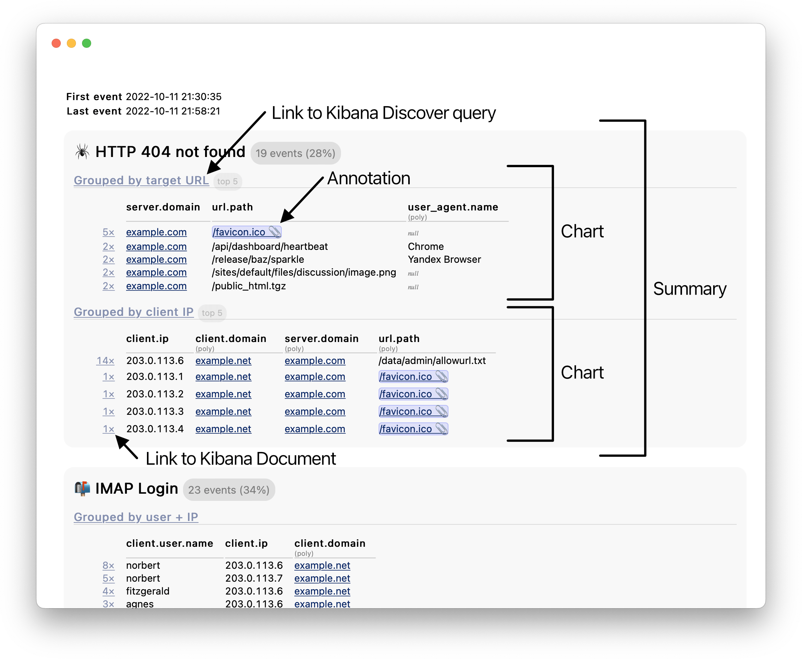
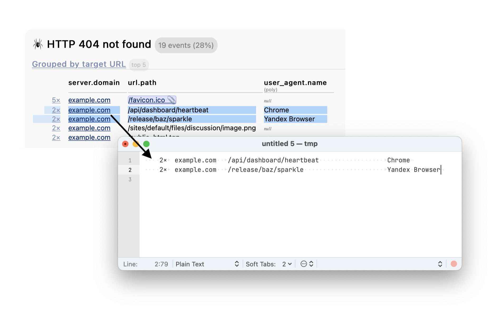

## Draff
**Inputs logs, outputs a daily email summary.**

Helps find unusual/interesting/concerning log messages among the morass of draff.
Similar to [Logwatch](https://logwatch.sourceforge.net/) or [Epylog](https://directory.fsf.org/wiki/Epylog),
but designed to integrate with [ELK (Logstash + Elasticsearch + Kibana)](https://www.elastic.co/what-is/elk-stack).



### Setup
1. **Write logs to a daily newline-delimited JSON dumpfile**
   - <details><summary>Configure Logstash</summary>

      ```logstash
      output {
         …
         file {
            path => '/var/log/logstash/dump-%{+YYYYMMdd}.ndjson'
            codec => json_lines
         }
      }
      ```

      </details>
   - <details><summary>Optionally configure Logstash to assign a unique ID to each log event <em>before</em> indexing to Elasticsearch</summary>

      ```logstash
      filter {
         …
         uuid {
            target => '_id'
         }
      }
      output {
         elasticsearch {
            document_id => '_id'
            …
         }
         …
      }
      ```

      Now Logstash will write the unique ID to the JSON dumpfile, which enables Draff to provide a link from the email to the Kibana document viewer.
      (Without this, Elasticsearch will automatically assign a unique ID, but Logstash won't know about it.)
      </summary>
   - Optionally configure Logrotate to delete old daily dumpfiles.

2. **Send daily summary emails**
   - Install PHP 8 and the PHP PECL yaml extension (e.g. `dnf install php-pecl-yaml`)
   - Copy `example-draff.yaml` to `draff.yaml`, then:
      - ⚙️ Adjust the general configuration
      - 📋 Define custom tables/aggregations
      - 📎 Define custom annotations
      - 🔀 Define custom text replacements/deduplications
   - Add a crontab entry to run it daily:
      ```crontab
      10 0 * * * /opt/draff/draff --yesterday --html --email
      ```

3. **Review the daily summary emails** to find out about exciting new problems.
   - The email is formatted so you can copy-paste multiple lines into a text editor, and they'll line up nicely:
     
